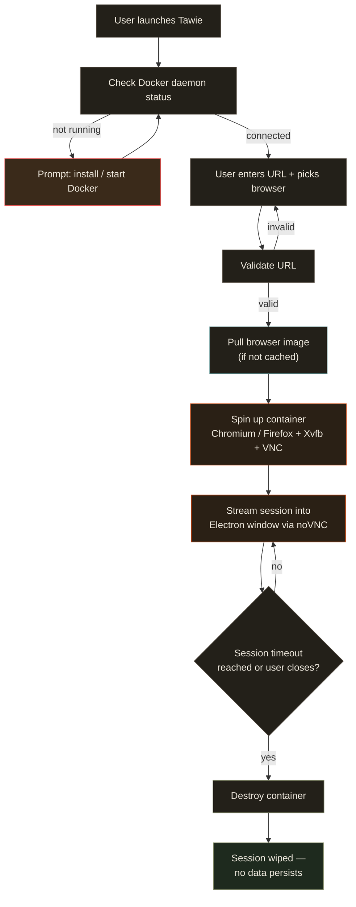
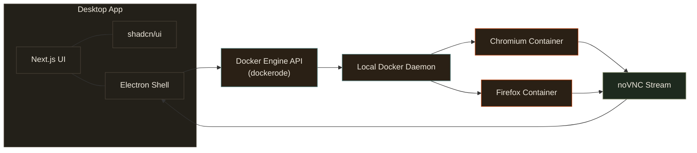

<div align="center">

# Tawie

**A disposable browser sandbox for the links you don't trust.**

Open-source · Self-hosted · Zero cost · Runs entirely on your machine

[](LICENSE)
[](https://www.electronjs.org/)
[](https://www.docker.com/)

</div>

---

## What is Tawie?

Tawie spins up a fully isolated, disposable browser inside a Docker container **on your own machine**, so you can open untrusted links, sketchy downloads, or shady sites without risking your real browser, files, or system.

It's not a VPN (doesn't hide your IP) and it's not incognito mode (doesn't isolate your OS). Tawie's guarantee is **containment**: even if a site is malicious, it dies with the container. Nothing touches your real machine.

No servers. No accounts. No data leaves your computer. Everything runs locally through Docker.

---

## Why Tawie?

| | Incognito | VPN | Tawie |
|---|---|---|---|
| Hides your IP from the site | ❌ | ✅ | ❌ |
| Isolates the browser from your OS | ❌ | ❌ | ✅ |
| Malware/exploit stays contained | ❌ | ❌ | ✅ |
| Wipes clean after every session | ⚠️ (local only) | ❌ | ✅ |
| Costs you anything | Free | Often paid | Free, forever |

Incognito doesn't stop a malicious site from seeing who you are — it just skips saving history locally. A VPN hides your IP, but the exploit still lands on your real machine. Tawie runs the browser somewhere it can't touch you at all.

---

## Architecture



**How it works, in short:**

1. The Electron app talks to your **local Docker daemon** — never a remote server.
2. When you launch a session, Tawie pulls (or reuses a cached) browser image and starts a container running a real headful browser inside a lightweight virtual display.
3. That container's screen is streamed into the app window over a local VNC connection.
4. Every session has a timer. When it expires — or you close it manually — the container is destroyed and everything inside it is gone for good.

---

## Tech Stack



- **Frontend / Shell:** Electron + Next.js + shadcn/ui
- **Container runtime:** User's local Docker (not bundled — a documented prerequisite)
- **Browser containers:** Prebuilt images per browser, streamed via noVNC
- **Orchestration:** Electron main process ↔ Docker Engine API via `dockerode`

---

## System Requirements

| | Minimum | Recommended |
|---|---|---|
| RAM | 8 GB | 16 GB |
| Free storage | 5 GB | 10 GB |
| CPU | 2 cores | 4 cores |
| Docker | Required — [install here](https://www.docker.com/products/docker-desktop/) | — |

Rough first-run footprint: Tawie app (~150 MB) + Docker Desktop (~1.5–2 GB) + one browser image (~300–450 MB) ≈ 2 GB before first use. Each additional browser adds ~300–400 MB.

---

## Getting Started

```bash
# 1. Install Docker Desktop (if you don't already have it)
#    https://www.docker.com/products/docker-desktop/

# 2. Clone the repo
git clone https://github.com/srirae/tawie.git
cd tawie

# 3. Install dependencies
pnpm install

# 4. Run in development
pnpm run dev

# 5. Or build the desktop app
pnpm run build:win #for windows

```
---

## Why Self-Hosted?

Tawie runs entirely on your own hardware, through your own Docker daemon. There's no backend, no account, no telemetry, and no server for the maintainer to pay for or moderate. This isn't just a cost decision — it means your sessions never touch infrastructure you don't control.

---

## License

[MIT](LICENSE) — free to use, modify, and self-host.

</div>